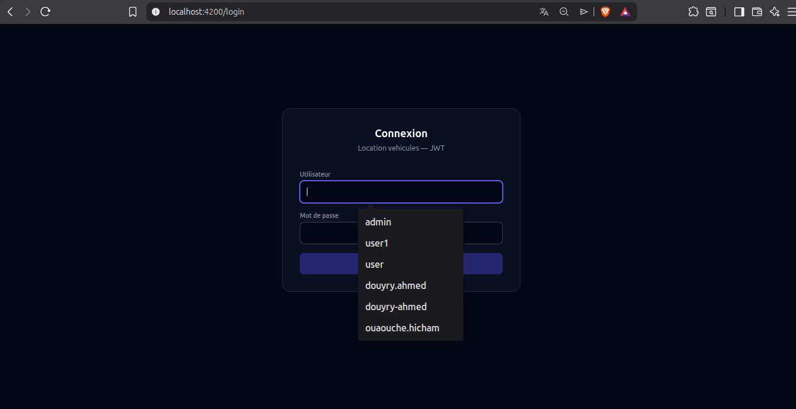
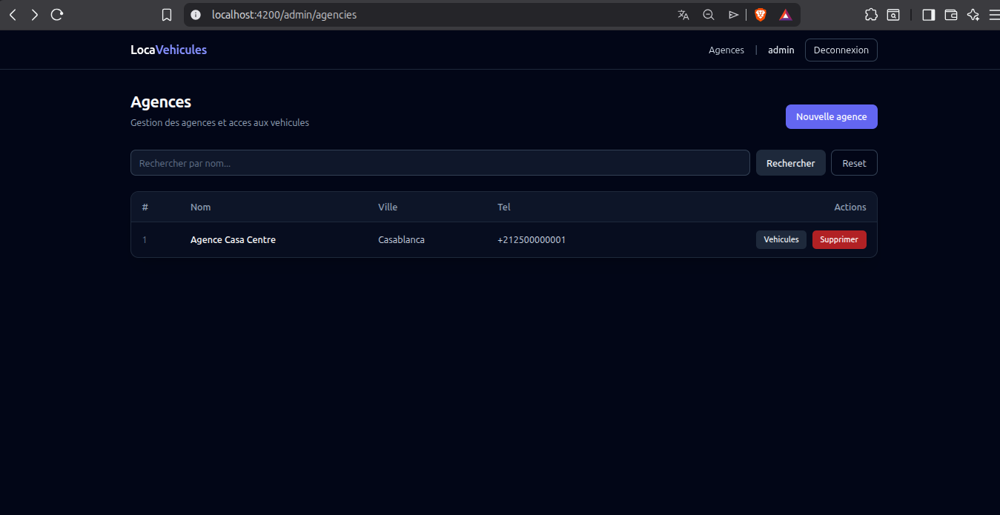

# Location véhicules — Spring Boot + Angular (JWT)

Projet full‑stack :
- **Backend** : Spring Boot (Java 21), JPA, Spring Security, JWT
- **Frontend** : Angular 21

## Prérequis

- **Java 21** (JDK)
- **Maven**
- **Node.js + npm**
- **MySQL** (par défaut)

## Lancer le backend

Depuis la racine du projet :

```bash
cd backend
mvn spring-boot:run
```

Configuration DB (voir `backend/src/main/resources/application.properties`) :
- URL : `jdbc:mysql://localhost:3306/location_db?createDatabaseIfNotExist=true`
- user : `root`
- password : *(vide)*

Le backend écoute sur `http://localhost:8080`.

## Lancer le frontend

```bash
cd front-end
npm install
npm start
```

Frontend : `http://localhost:4200`

## Authentification (JWT)

Endpoint :
- `POST /auth/login` (body JSON `{ "username": "...", "password": "..." }`)

Comptes de test (seed) :
- `admin / 1234`
- `employe / 1234`
- `client / 1234`

Le token est stocké dans le navigateur (`localStorage`) et envoyé dans l’en-tête :
- `Authorization: Bearer <token>`

## Screenshots

### Login



### Agences



### Côté client


### JWT token (localStorage)


### Ajouter véhicule / moto + véhicules par agence


